# Library of reusable components - 50 projects in 50 days

This repository contains reusable components useful in front end development created with course 50 projects in 50 days created by Brad Traversy and Florin Pop, available on an O'Reilly platform (https://learning.oreilly.com/videos/50-projects-in/9781801079976/).

This course was a part of my learning path during scholarship awarded by O'Reilly.

# List of reusable components

# Boilerplate

Boilerplate for all course components.

# Day 1 - Expanding cards (panels)

# Day 2 - Step Functionality

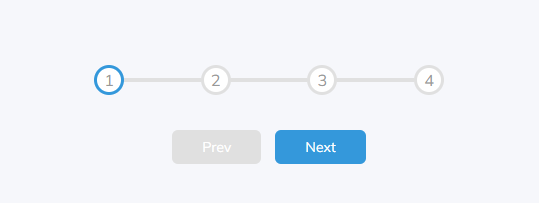

# Day 3 - Rotating Navigation

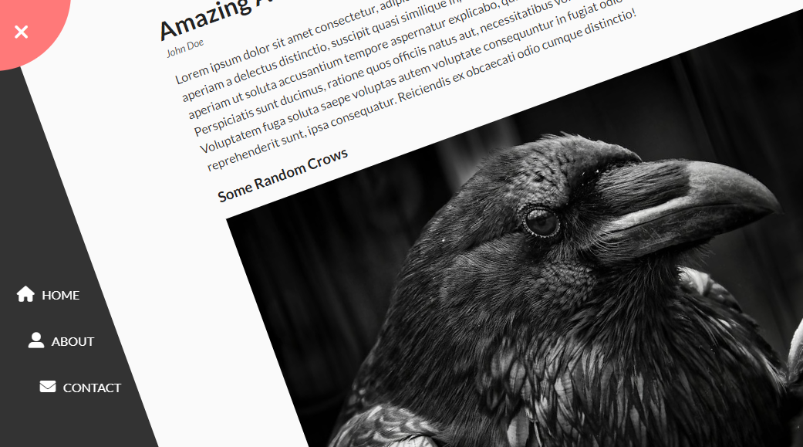

# Day 4 - Hidden Search Widget

# Day 5 - Blurry Loading

# Day 6 - Scroll Animation

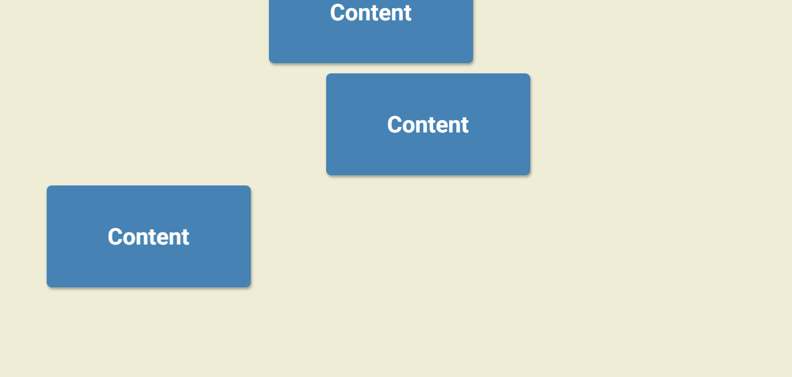

# Day 7 - Split Landing Page

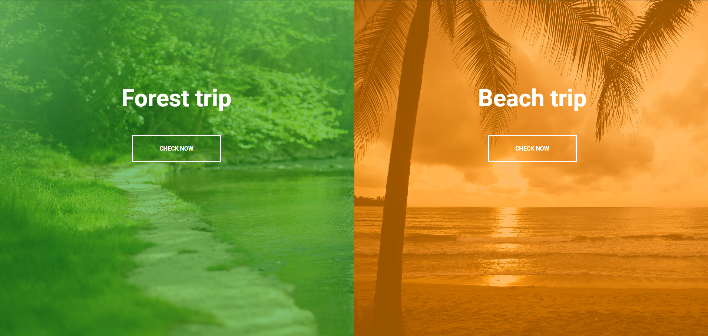

# Day 8 - Styling the Form

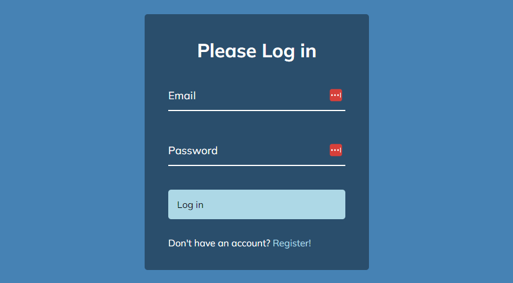

# Day 9 - Sounds Board

# Day 10 - Daddy Jokes

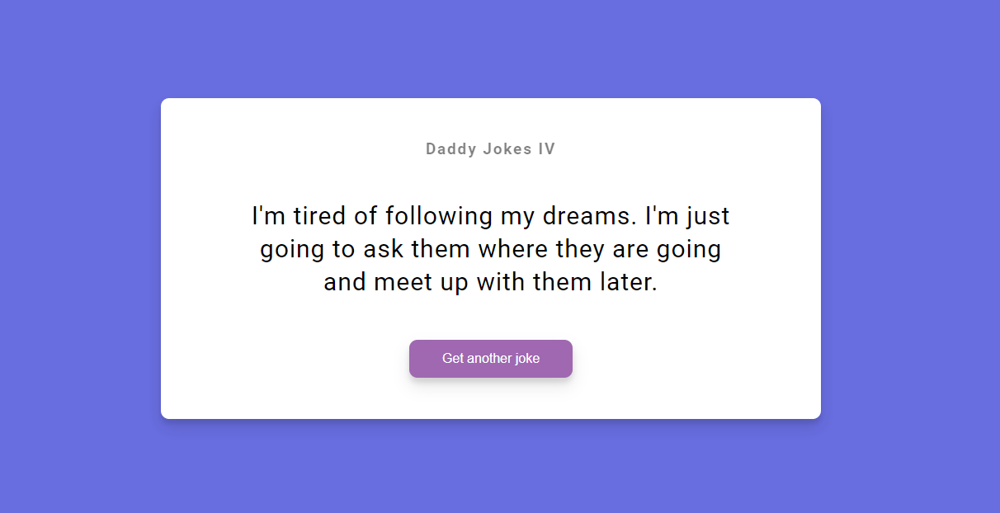

# Day 11 - Key Codes

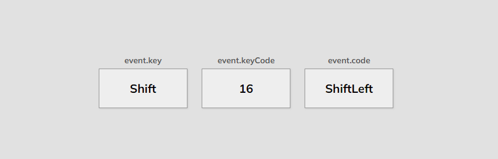

# Day 12 - FAQ Collapse

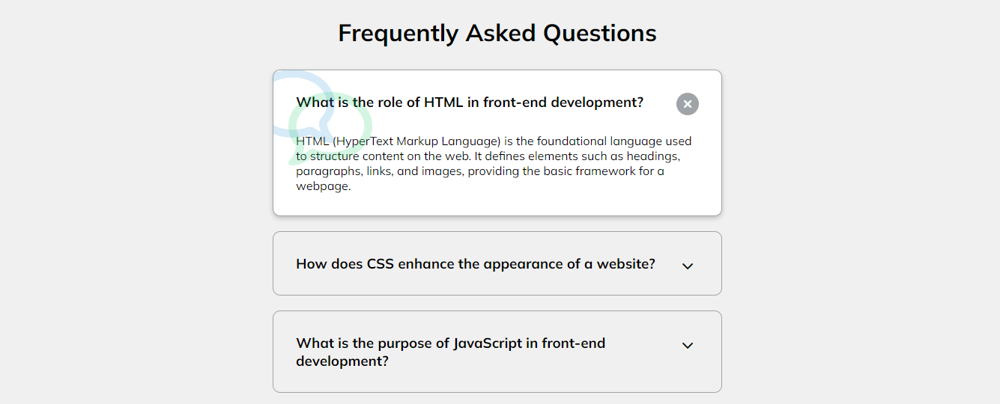

# Day 13 - Random Choice Picker

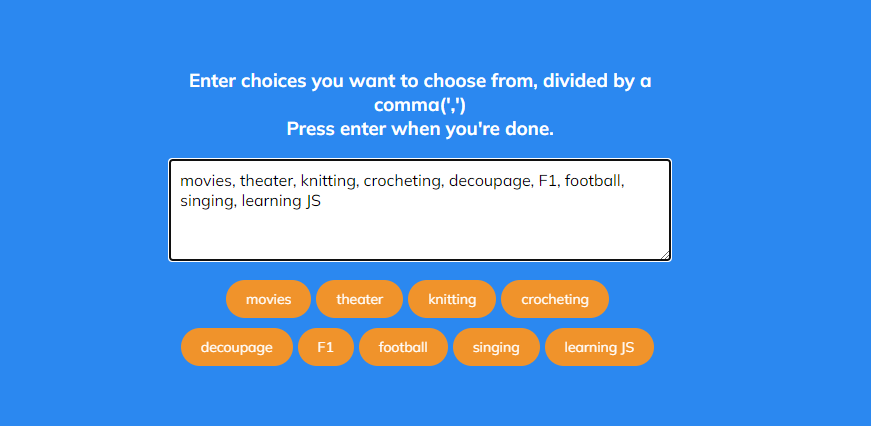

# Day 14 - Animated Navigation

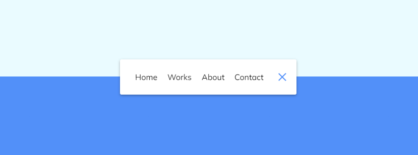

# Day 15 - Incrementing Counter

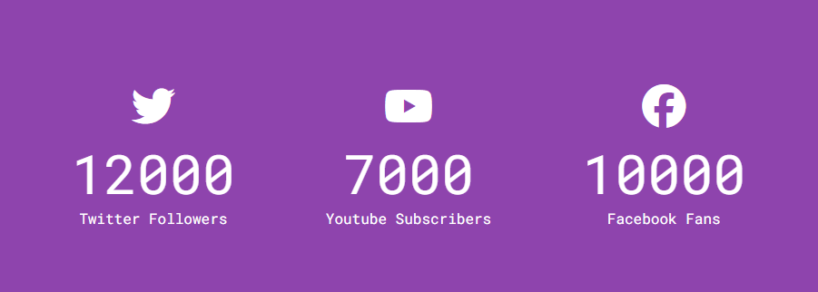

# Day 16 - Drink Water

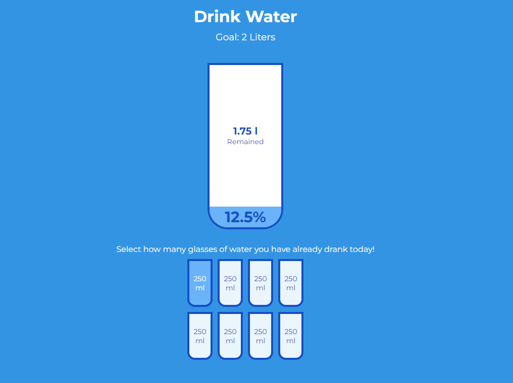

# Day 17 - Movie App

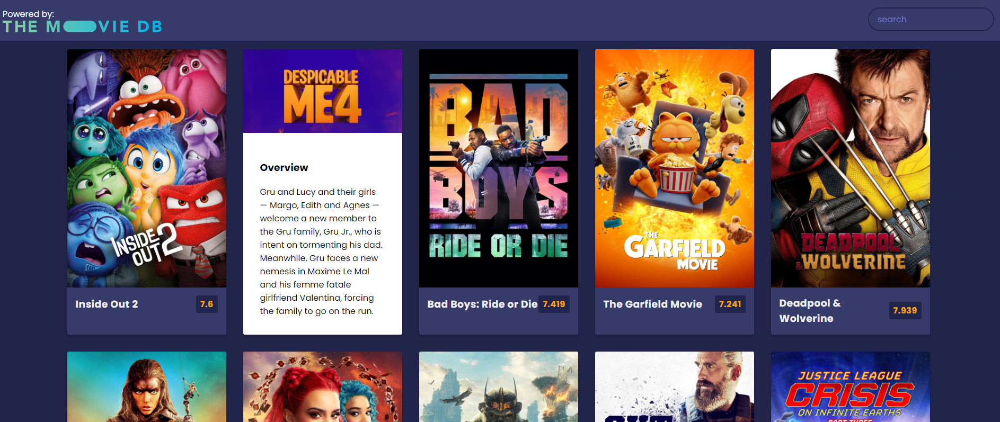

# Day 18 - Background slider

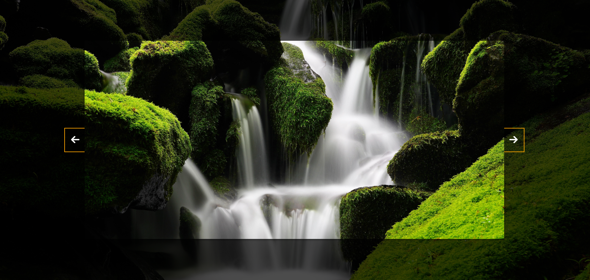

# Day 19 - Theme clock

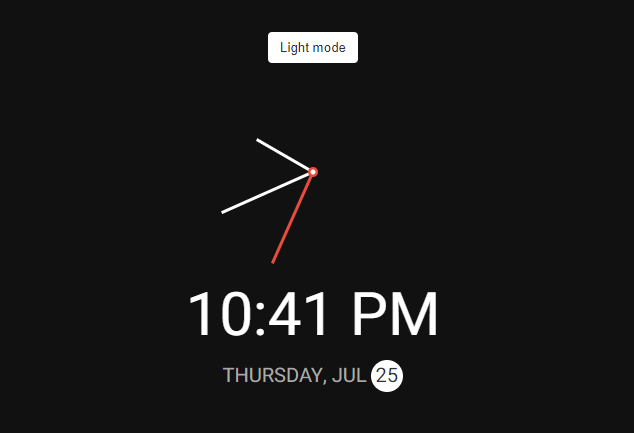

# Day 20 - Button Ripple Effect

# Day 21 - Drag N Drop

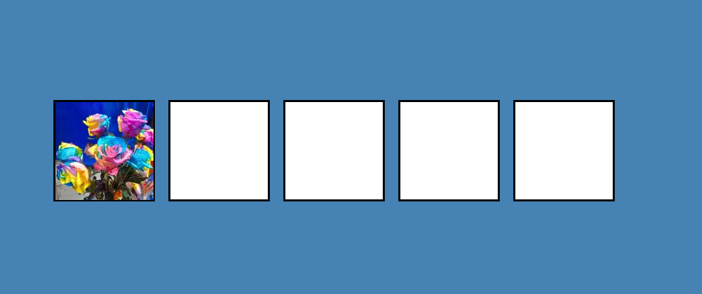

# Day 22 - Drawing App

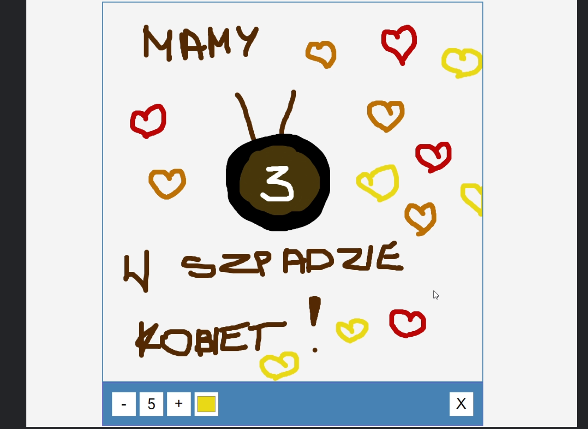

# Day 23 - Kinetic CSS loader

# Day 24 - Content Placeholder

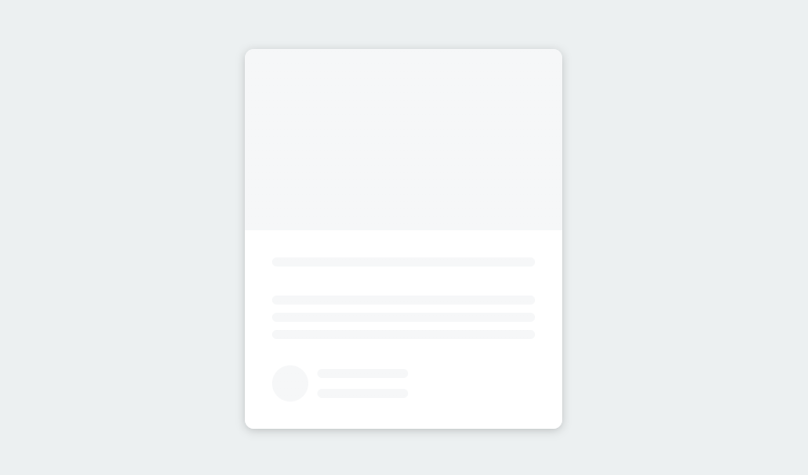

# Day 25 - Sticky Navbar
